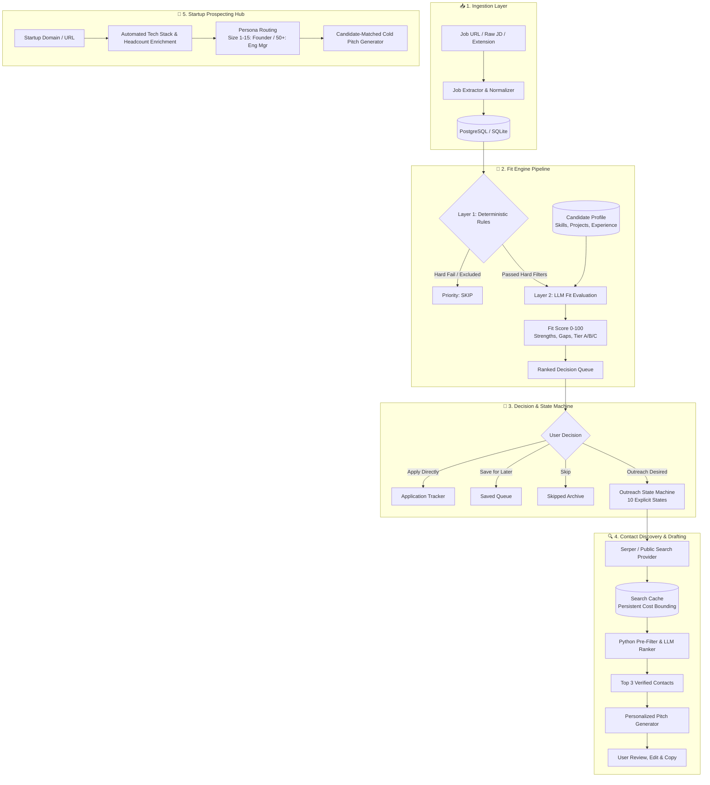

# 📄 DunderHunt 🎯

> **"Identity theft is not a joke, Jim! Millions of families suffer every year!"** — Dwight Schrute  
> *...and neither is the job hunt.*

**DunderHunt** is a single-user, decision-support job hunting and outreach command center. It turns an overwhelming, chaotic job search into a clean, ranked queue of actionable decisions—giving you AI-driven deep analysis while keeping human judgment strictly in the driver's seat.

---

## 🏢 Why the Name?

Yes, it's 100% an homage to **Dunder Mifflin** from *The Office* 📎.

Job hunting often feels like working under Michael Scott's management or pushing endless reams of paper into the corporate void: repetitive applications, messy spreadsheets, phantom recruiters, and cookie-cutter messages. **DunderHunt** was built to bring order, speed, and intelligence to the paper-pushing grind.

---

## 💡 Why I Built This (The Personal Workflow)

Job hunting in tech usually breaks down into two flawed extremes:
1. **The Spray & Pray Bot approach:** Tools that automatically blast 500 unvetted resumes or send automated robotic LinkedIn spam. This hurts your reputation, wastes recruiter time, and results in low response rates.
2. **The Spreadsheet Hell approach:** Manually reading 50 JDs a day, copying bullet points into Notion, cross-referencing your resume, hunting for recruiters on LinkedIn, and crafting cold emails from scratch. You burn out in a week.

**DunderHunt was built around a specific personal workflow:**
1. **One Ingestion Action:** Quickly drop a job URL or paste raw JD text whenever a role catches your eye.
2. **Deterministic Pre-Filtering + AI Evaluation:** Automatically check hard filters (visa/work auth, location, excluded companies) deterministically, then evaluate deep technical fit (skills, real project experience, work history) with an LLM.
3. **Decisive Queue:** Assign every job an objective Fit Score (0–100), a Priority Tier (A, B, C, or Skip), and **ONE clear next action** (`APPLY`, `APPLY + OPTIONAL OUTREACH`, `SAVE`, or `SKIP`).
4. **On-Demand Contact Discovery & Tailored Outreach:** When ready to apply, discover relevant engineering managers or recruiters with 1 click, inspect their roles, and generate crisp, personalized email/LinkedIn pitch drafts matching your real projects to their tech stack.
5. **Startup Prospecting Hub:** Discover early-stage startups, automatically enrich their headcount and tech stack, identify key decision makers (Founder/CTO for early-stage, Eng Manager for growth-stage), and generate high-conversion pitches.

---

## 🤖 The Role of Automation

> ### **Core Principle:** *"AI performs the analysis. The user makes the decision."*

DunderHunt draws a strict line between **cognitive assistance** and **user autonomy**:

| What DunderHunt Automates ⚡ | What DunderHunt NEVER Automates 🛑 |
|---|---|
| Scraping & normalizing messy job postings | **Auto-submitting applications** (You always review and submit) |
| Deterministic hard-filter checks (work auth, locations) | **Auto-sending cold emails/messages** (Drafts are strictly review-only) |
| Deep alignment scoring against candidate skills & projects | **Auto-rejecting jobs without user confirmation** |
| Public search queries & search snippet caching (via Serper/Tavily) | Scraping LinkedIn behind logins (respecting anti-bot/TOS) |
| Generating hyper-personalized outreach drafts tailored to specific tech stacks | Black-box automated decision-making without auditability |

---

## 🏗️ Architecture & System Flow

DunderHunt is built with a **FastAPI (Python 3.10+)** backend and a **Next.js 15 (React 19 / TypeScript / Tailwind CSS)** frontend.



---

## 🎨 Key Design Choices & Architecture Decisions

1. **Two-Layered Fit Scoring ([scoring.md](file:///c:/Users/Samri/Desktop/Work%20&%20Projects/Coding/Coding%20and%20stuff/DunderHunt/docs/scoring.md)):**
   - **Layer 1 (Deterministic):** Evaluates work authorization, remote/location rules, and excluded companies in zero milliseconds without wasting LLM tokens.
   - **Layer 2 (LLM Reasoning):** Evaluates candidate's actual projects, work experience accomplishments, and specific tech stack alignment using structured Pydantic schemas.
2. **Explicit 10-State Outreach Machine ([ADR-003](file:///c:/Users/Samri/Desktop/Work%20&%20Projects/Coding/Coding%20and%20stuff/DunderHunt/docs/architecture.md)):**
   - Outreach isn't just a modal text area; it has its own decoupled lifecycle: `OFF` ➔ `ENABLED` ➔ `CHOOSING_CONTACT` ➔ `DISCOVERING` ➔ `CONTACT_SELECTED` ➔ `DRAFTING` ➔ `DRAFT_READY` ➔ `SENT` ➔ `FOLLOW_UP_AVAILABLE` ➔ `FOLLOWED_UP`.
3. **Bounded Search Costs & Zero LinkedIn Scraping ([ADR-002](file:///c:/Users/Samri/Desktop/Work%20&%20Projects/Coding/Coding%20and%20stuff/DunderHunt/docs/architecture.md), [ADR-004](file:///c:/Users/Samri/Desktop/Work%20&%20Projects/Coding/Coding%20and%20stuff/DunderHunt/docs/architecture.md)):**
   - Contact discovery uses Google Search API (Serper.dev or Tavily) indexing public profiles rather than brittle session-based scrapers. All search queries are cached in a `search_cache` table to guarantee max 1 search call per unique company/role.
4. **Persona-Based Startup Routing ([ADR-005](file:///c:/Users/Samri/Desktop/Work%20&%20Projects/Coding/Coding%20and%20stuff/DunderHunt/docs/architecture.md)):**
   - Automatically routes outreach based on startup headcount: Seed/Series A (1–15 employees) targets Founders/CTOs; Growth (50–200 employees) targets Engineering Managers or Recruiters.
5. **Typed API Boundaries & Isolated Prompts:**
   - 100% Pydantic v2 schemas on FastAPI endpoints and matching TypeScript interfaces on Next.js.
   - Zero hardcoded prompts in application code—all system prompts live versioned in `backend/app/prompts/`.

---

## 🛠️ Tech Stack & Requirements

### What You'll Need:
* **Python**: 3.10+
* **Node.js**: 18+ (Node 20+ recommended) & `npm`
* **Database**: SQLite (default for instant setup) or PostgreSQL 16+
* **Cache** *(Optional)*: In-memory TTL cache (default) or Redis 7+
* **LLM Provider API Key** *(At least one)*:
  * OpenAI (`gpt-4o-mini`, `gpt-4o`)
  * Google Gemini (`gemini-1.5-flash`, `gemini-1.5-pro`)
  * Anthropic Claude (`claude-3-5-sonnet`)
  * *Or `LLM_PROVIDER=mock` for offline zero-cost local testing*
* **Search API Key** *(Optional for contact discovery)*:
  * Serper.dev (`SERPER_API_KEY`) or Tavily (`TAVILY_API_KEY`)
  * *Or `SEARCH_API_PROVIDER=mock` for mock contact results*

---

## 🚀 Quickstart & Setup Guide

### Option 1: Local Development (Fastest)

#### 1. Clone the Repository
```bash
git clone https://github.com/samridhsri/DunderHunt.git
cd DunderHunt
```

#### 2. Configure Backend Environment
Create `backend/.env` (or copy from `.env.example`):
```bash
cp .env.example backend/.env
```
Edit `backend/.env` with your preferred keys:
```ini
DATABASE_URL=sqlite+aiosqlite:///./dunderhunt.db
LLM_PROVIDER=openai
OPENAI_API_KEY=sk-your-openai-key-here
OPENAI_MODEL=gpt-4o-mini

SEARCH_API_PROVIDER=serper
SERPER_API_KEY=your-serper-key-here

PORT=8000
HOST=0.0.0.0
CORS_ORIGINS=["http://localhost:3000"]
```

#### 3. Start the Backend
```bash
cd backend
python -m venv .venv

# Activate virtual environment:
# On Windows (PowerShell):
.venv\Scripts\Activate.ps1
# On macOS/Linux:
# source .venv/bin/activate

pip install -e .
python main.py
```
Backend API will be live at `http://localhost:8000` (Swagger docs at `http://localhost:8000/docs`).

#### 4. Start the Frontend
In a new terminal:
```bash
cd frontend
npm install
npm run dev
```
Open `http://localhost:3000` in your browser.

---

### Option 2: Docker Compose

To spin up the entire stack with PostgreSQL, Redis, FastAPI, and Next.js:

```bash
docker-compose up --build
```

---

## 📂 Project Structure

```text
DunderHunt/
├── backend/
│   ├── app/
│   │   ├── api/routes/         # FastAPI endpoints (jobs, profile, outreach, startups, search)
│   │   ├── core/               # App configuration, logging, database sessions
│   │   ├── models/             # SQLAlchemy ORM database models
│   │   ├── prompts/            # Versioned, structured LLM prompt templates
│   │   ├── schemas/            # Pydantic v2 request/response schemas
│   │   └── services/
│   │       ├── fit/            # 2-layer candidate fit evaluation engine
│   │       ├── ingestion/      # JD extractors, deduplication & normalization
│   │       ├── outreach/       # 10-state machine, message generator, follow-up
│   │       ├── startups/       # Company enrichment, persona routing & pitch generator
│   │       └── contacts/       # Serper/Tavily search provider & candidate ranker
│   ├── tests/                  # Unit & integration test suites
│   ├── main.py                 # FastAPI application entry point
│   └── pyproject.toml          # Python package & dependency configuration
├── frontend/
│   ├── src/
│   │   ├── app/                # Next.js App Router (Dashboard, Profile, Startups, Outreach)
│   │   ├── components/         # Reusable React UI components & domain panels
│   │   └── lib/                # API client, TypeScript types, and utilities
│   └── package.json            # Frontend package configuration
├── docs/
│   ├── product-spec.md         # Product goals, boundaries, and rules
│   ├── architecture.md         # Full schema specs & Architecture Decision Records (ADRs)
│   └── scoring.md              # Detailed breakdown of fit scoring math
├── docker-compose.yml          # Container orchestration (Postgres, Redis, Backend, Frontend)
└── AGENTS.md                   # AI Agent development rules and invariant guidelines
```

---

## 🧪 Running Tests

```bash
cd backend
pytest -v
```

---

## 📜 License

MIT License. Feel free to use, customize, and adapt DunderHunt for your own job search!

*"You miss 100% of the shots you don't take. — Wayne Gretzky" — Michael Scott* 🏒
